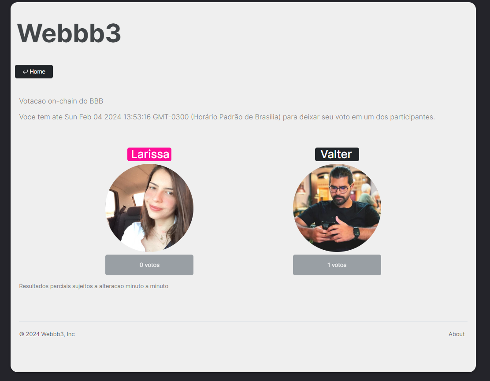
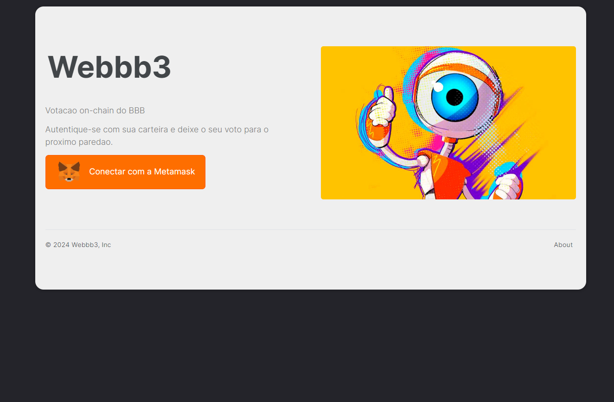
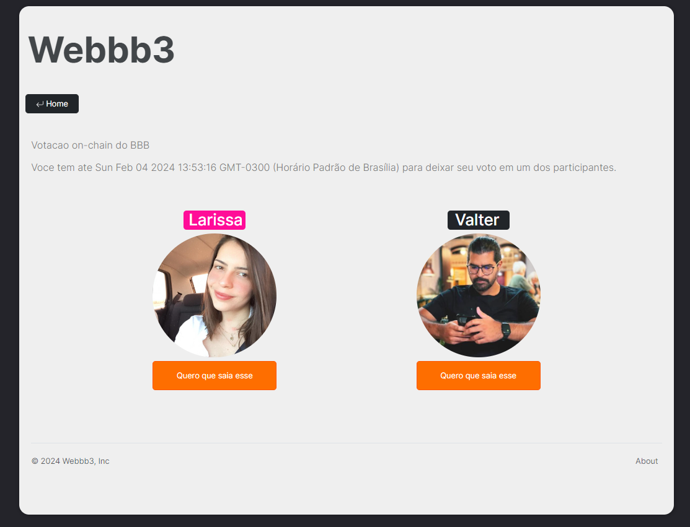
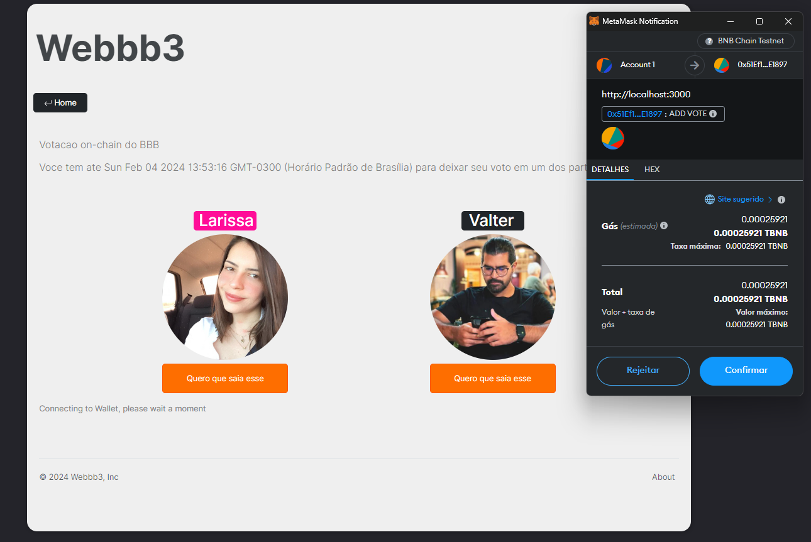
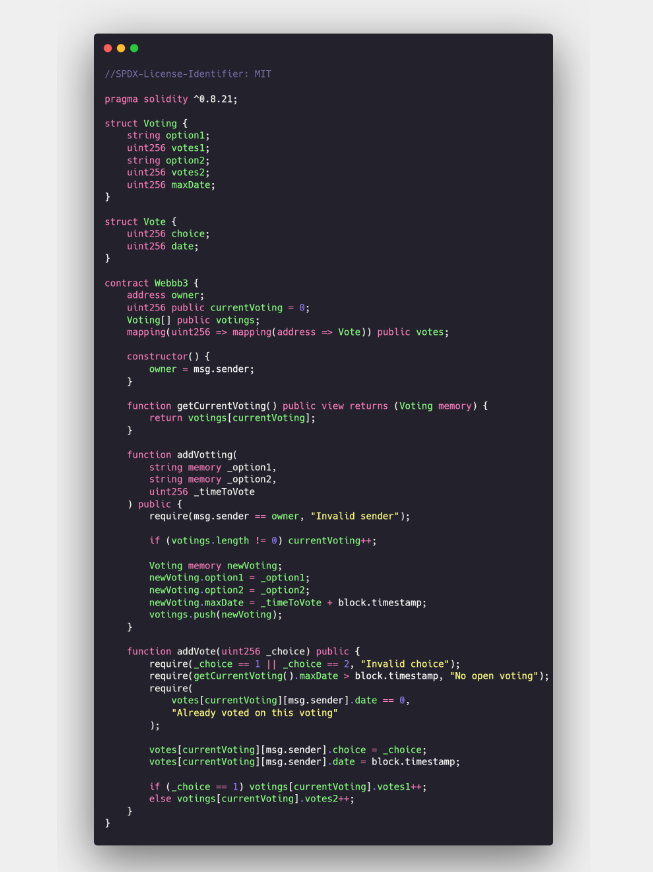

<h1 align="center">Dapp - Web3</h1>

 🚀 Solidity com React

<h1 align="center"></h1>

•
 <a href="#objetivo">Objetivo</a> •
 <a href="#tecnologias">Tecnologias</a> • 
 <a href="#autor">Autor</a> •

<h1 align="center">
    
    
    
    
    
    
</h1>

## **Objetivo**

 🔍 Aprendendo a criar um Dapp em Next com bootstrap e a se comunicar com um Smart Contract em Solidity salvo em uma Blockchain por meio da Metamask seguindo o curso:  <a href="https://www.luiztools.com.br/">Luiz Tools - Web3</a> 

## **Tecnologias**

<ul> ⚙️ Visão Geral
    <li>🛠 Solidity
    <li>🛠 Blockchain
    <li>🛠 Metamask
    <li>🛠 NextJS
    <li>🛠 React
    <li>🛠 Bootstrap
    
</ul>

## **Autor**

 Desenvolvido por <a href="https://github.com/valtercfjunior">Valter Junior</a>, seguindo o mestre <a href="https://www.luiztools.com.br/">Luiz Tools</a> 

